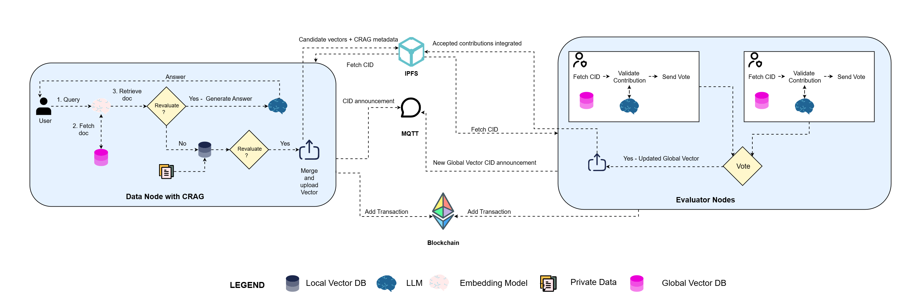
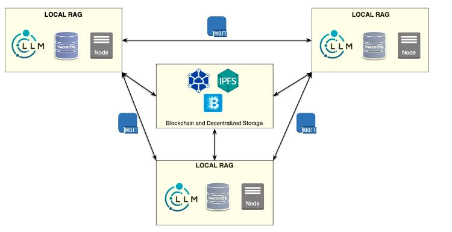

# Decentralized Retrieval-Augmented Generation (DRAG)



This repository presents a decentralized extension of Retrieval-Augmented Generation (RAG), addressing privacy, scalability, and security challenges in traditional RAG systems using IPFS, MQTT, and blockchain technologies.

This work is grounded in our research on decentralized learning systems, particularly **Decentralized Retrieval-Augmented Generation (DRAG)**, as presented in [3].

DRAG enables users to interact with local knowledge bases while contributing to a global shared database—promoting **knowledge democratization**, **trustless collaboration**, and **incentivized participation**.

---

## 📄 Research Publication

This repository is based on our published research work:

**Continuous Learning in Decentralized Retrieval-Augmented Generation (DRAG) and Data Management**
F. A. Khan, C. Peiper, A. Jaberzadeh, M. A. Shaikh, et al.
*Proceedings of the 4th Blockchain and Cryptocurrency Conference (B2C'25)*, 2025, pp. 45–48

🔗 Read the paper:
[https://www.researchgate.net/profile/Sergey-Yurish/publication/398276090_Blockchain_and_Cryptocurrency_B2C'_2025_Edited_by_Sergey_Y_Yurish/links/6930219f0e91876082c0d022/Blockchain-and-Cryptocurrency-B2C-2025-Edited-by-Sergey-Y-Yurish.pdf#page=46](https://www.researchgate.net/profile/Sergey-Yurish/publication/398276090_Blockchain_and_Cryptocurrency_B2C'_2025_Edited_by_Sergey_Y_Yurish/links/6930219f0e91876082c0d022/Blockchain-and-Cryptocurrency-B2C-2025-Edited-by-Sergey-Y-Yurish.pdf#page=46)

---

## 🚀 DRAG Overview

DRAG enhances traditional RAG by decentralizing storage, communication, and computation layers, ensuring:

* **Privacy** → Secure, decentralized data storage using IPFS
* **Scalability** → Distributed knowledge contribution without central bottlenecks
* **Security** → Blockchain-backed transparency and tamper-proof records
* **Incentivization** → Reward mechanisms for contributors
* **Collaborative Learning** → Continuous improvement from distributed nodes

---

## 🧠 Key Technologies

* **IPFS** → Decentralized storage layer
* **MQTT** → Lightweight, low-latency communication protocol
* **Blockchain** → Trustless validation and reward system
* **Qdrant** → High-performance vector database for semantic retrieval

---

## ⚖️ Traditional RAG vs. DRAG

The core difference lies in **centralization vs decentralization**.

### Traditional RAG


*Centralized architecture with a single knowledge base*

### DRAG


*Decentralized architecture with multiple nodes contributing to a global knowledge base*

---

## 🏗️ Architecture

The system consists of two primary node types:

### 1. Data Nodes

* Provide domain-specific knowledge
* Generate embeddings and contribute to the global vector database

### 2. Evaluator Nodes

* Validate incoming contributions
* Maintain data quality and integrity

---

### 🔗 Blockchain-Based Incentive Layer

* Records contributions transparently
* Rewards high-quality data providers
* Penalizes malicious or low-quality inputs

This mechanism ensures:

* Higher data reliability
* Sustainable ecosystem growth
* Trustless collaboration

---

## ⚙️ Setup and Installation

### 1. Clone and Build

```bash
git clone https://github.com/bayesianinstitute/Decentralized-RAG
cd Decentralized-RAG
```

```bash
python setup.py sdist bdist_wheel
pip install .
```

---

### 2. Run Using Docker

Start all services:

```bash
docker compose up -d
```

Download model and run:

```bash
bash run.sh
```

---

## 🧩 Qdrant Setup (Vector Database)

### Pull Image

```bash
docker pull qdrant/qdrant
```

### Run Container

```bash
docker run -d -p 6333:6333 -p 6334:6334 \
    -v ./qdrant_data:/qdrant/storage \
    qdrant/qdrant
```

### Windows:

```bash
docker run -d --name qdrant_container -p 6333:6333 -p 6334:6334 \
    -v C:/path/to/qdrant_data:/qdrant/storage \
    qdrant/qdrant:latest
```

---

## 🤖 Model Setup

### Install Ollama

Follow: [https://ollama.ai/](https://ollama.ai/)

### Pull LLM

```bash
ollama pull llama3:8b
```

### Pull Embedding Model

```bash
ollama pull nomic-embed-text:latest
```

---

## ▶️ Running the Application

### Configure Node Type

Edit `main.py`:

* `admin` → Global coordinator node
* `data` → Knowledge contributor node

### Start Application

```bash
python main.py --data-dir data --nodetype admin
```

---

## 🌐 IPFS Installation

Follow official docs: [https://docs.ipfs.tech/install/](https://docs.ipfs.tech/install/)

### Windows Example:

```bash
wget https://dist.ipfs.tech/kubo/v0.23.0/kubo_v0.23.0_windows-amd64.zip -Outfile kubo_v0.23.0.zip
Expand-Archive -Path kubo_v0.23.0.zip -DestinationPath .\kubo
cd .\kubo
.\install.bat
```

---

## 📌 Conclusion

DRAG demonstrates how decentralized architectures can significantly enhance Retrieval-Augmented Generation systems by:

* Reducing hallucination and retrieval errors
* Preserving user privacy
* Enabling continuous decentralized learning
* Incentivizing high-quality knowledge contributions

By integrating **blockchain, distributed storage, and vector search**, DRAG provides a scalable and secure foundation for next-generation AI systems.

---

## 🔗 Repository

GitHub:
[https://github.com/bayesianinstitute/Decentralized-RAG](https://github.com/bayesianinstitute/Decentralized-RAG)

---

## 📚 References

[1] Ollama Docker Hub: [https://hub.docker.com/r/ollama/ollama](https://hub.docker.com/r/ollama/ollama)
[2] IPFS Documentation: [https://docs.ipfs.tech](https://docs.ipfs.tech)

[3] F. A. Khan, C. Peiper, A. Jaberzadeh, M. A. Shaikh, et al.,
"Continuous learning in decentralized retrieval-augmented generation (DRAG) and data management,"
in *Proceedings of the 4th Blockchain and Cryptocurrency Conference (B2C'25)*, 2025, pp. 45–48.
Available:
[https://www.researchgate.net/profile/Sergey-Yurish/publication/398276090_Blockchain_and_Cryptocurrency_B2C'_2025_Edited_by_Sergey_Y_Yurish/links/6930219f0e91876082c0d022/Blockchain-and-Cryptocurrency-B2C-2025-Edited-by-Sergey-Y-Yurish.pdf#page=46](https://www.researchgate.net/profile/Sergey-Yurish/publication/398276090_Blockchain_and_Cryptocurrency_B2C'_2025_Edited_by_Sergey_Y_Yurish/links/6930219f0e91876082c0d022/Blockchain-and-Cryptocurrency-B2C-2025-Edited-by-Sergey-Y-Yurish.pdf#page=46)
